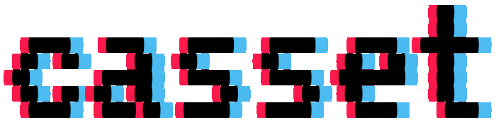

[](https://raw.githubusercontent.com/rytsh/casset/main/LICENSE)
[](https://sonarcloud.io/summary/overall?id=rytsh_casset)
[](https://github.com/rytsh/casset/actions)
[](https://goreportcard.com/report/github.com/rytsh/casset)
[](https://pkg.go.dev/github.com/rytsh/casset)

Casset is double linked endless memory library.

Always generate new space automatically.

Memory hold length, front, back and current location  
Element hold value belong memory address and next, previous elements address.

## Installation

```sh
go get github.com/rytsh/casset
```

## Usage

```go
// create a memory with a first value
// value could be anything
l := casset.NewMemory[any]().GetFront().SetValue("My First Element")
l.Next("second element").Next(3.14).Next(struct{ v string }{v: "4th element"})

// for e := l.GetMemory().GetFront(); e != nil; e = e.GetNextElement() {
// 	fmt.Println(e.GetValue())
// }

for e := range l.GetMemory().Range() {
    fmt.Println(e.GetValue())
}

// Output:
// My First Element
// second element
// 3.14
// {4th element}
```
