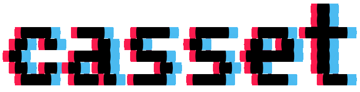

Casset is double linked endless memory library.

It always generate new space automatically for you so you cannot go to end of the list with next but you can manage it easily.

Memory hold length, front, back and current location  
Element hold value belong memory address and next, previos elements address.

## Usage

```go

```

## Installation

```sh
go get github.com/rytsh/casset
```

## License

[MIT](./LICENSE)
